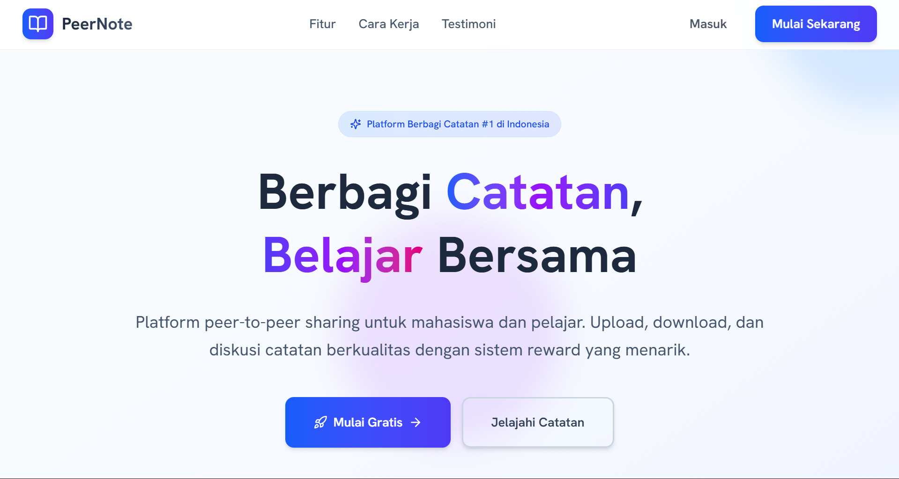

# 📚 Learning Platform

<p align="left">

  [](https://reactjs.org/)
  [](https://vitejs.dev/)
  [](https://tailwindcss.com/)

</p>

<a href="#" target="_blank">
  
</a>

<br />

<div align="center">

  **Modern web application for collaborative learning and content sharing**
  
  [🚀 Quick Start](https://github.com/zaki-ramadhan/peer-note-sharing-platform/edit/main/README.md#-quick-start) · [📖 Features](https://github.com/zaki-ramadhan/peer-note-sharing-platform/edit/main/README.md#-features) · [🛠️ Tech Stack](https://github.com/zaki-ramadhan/peer-note-sharing-platform/edit/main/README.md#%EF%B8%8F-tech-stack)

</div>

## 🌟 Overview

A responsive web platform that facilitates content sharing and community collaboration with modern design patterns.

## ✨ Features

- 🔍 **Content Discovery** - Search and filtering capabilities
- 📤 **File Upload** - Drag & drop interface with progress tracking
- 💬 **Community Forums** - Discussion threads and user interaction
- ⭐ **Rating System** - Community-driven content evaluation
- 🏆 **User Engagement** - Points and ranking system
- 🎨 **Modern Interface** - Contemporary design with smooth animations
- 📱 **Responsive Design** - Works across all device sizes

## 🛠️ Tech Stack

**Frontend:** React • Vite • Tailwind CSS • React Router  
**UI Components:** Custom component library  
**Styling:** Modern CSS patterns and animations

## 🚀 Quick Start

### Prerequisites

- Node.js >= 18.0.0
- npm >= 9.0.0

### Installation

```bash
# Clone repository
git clone https://github.com/your-username/learning-platform.git
cd learning-platform

# Install dependencies
npm install

# Start development server
npm run dev
```

### Available Scripts

```bash
npm run dev      # Development server
npm run build    # Production build
npm run preview  # Preview build
npm run lint     # Code linting
```

## 📁 Project Structure

```
src/
├── components/    # Reusable UI components
├── pages/         # Application pages/routes
├── assets/        # Static assets
└── data/          # Application data
```

## 🎨 Design System

Built with modern design principles featuring responsive layouts, consistent theming, and smooth user interactions.

## 🚀 Development

### Prerequisites

- Node.js >= 18.0.0
- Package manager (npm/yarn)

### Getting Started

1. Clone the repository
2. Install dependencies
3. Start development server
4. Open browser to view application

<div align="center">

**Built for the learning community**

</div>
